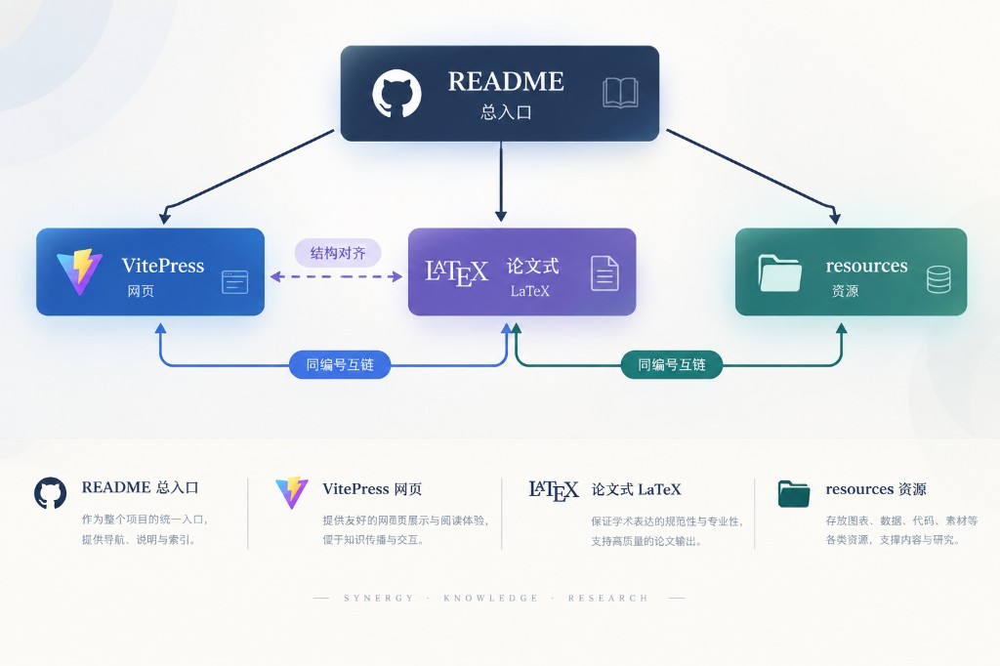

# AUFE课题组科研入门

<p align="center">
  
  
  
  
</p>

<p align="center">
  <b>深度学习 · 计算机视觉 · 医学影像 AI</b><br/>
  从文献到投稿的全流程入门体系 · 网页 / 手册 / 资源三端同构
</p>

<p align="center">
  <a href="https://enco1128.github.io/AUFE-Research-group-study-materials/"><b>在线学习站点（正式）</b></a> ·
  <a href="https://enco1128.github.io/Research-group-study-materials/"><b>旧地址自动跳转</b></a> ·
  <a href="https://github.com/enco1128/AUFE-Research-group-study-materials"><b>GitHub 仓库</b></a> ·
  <a href="https://github.com/enco1128/AUFE-Research-group-study-materials/blob/main/latex/main.tex"><b>Overleaf 手册源码</b></a>
</p>

> **正式站点：** https://enco1128.github.io/AUFE-Research-group-study-materials/  
> 旧路径 `.../Research-group-study-materials/` 仅作跳转兼容，请收藏正式地址。

---

## 为什么做这一套

科研入门最常见的失败模式不是「资料不够」，而是**资料很多、路径不清**：链接散落、模板与正文脱节、网页和 PDF 讲两套故事。

本仓库把组内经验整理成**同一套编号体系**，让新人可以按路线推进，而不是在文件夹里迷路。

<p align="center">
  
</p>

<p align="center"><sub>SYNERGY · KNOWLEDGE · RESEARCH — README 总入口串联网页、论文式手册与资源目录</sub></p>

<table width="100%">
  <thead>
    <tr>
      <th width="22%" align="center">介质</th>
      <th width="38%" align="center">角色</th>
      <th width="40%" align="center">入口</th>
    </tr>
  </thead>
  <tbody>
    <tr>
      <td align="center"><b>学习网页</b></td>
      <td align="center">日常阅读与导航（VitePress）</td>
      <td align="center"><a href="https://enco1128.github.io/AUFE-Research-group-study-materials/">GitHub Pages 站点</a></td>
    </tr>
    <tr>
      <td align="center"><b>论文式手册</b></td>
      <td align="center">可打印 / Overleaf 协作全文</td>
      <td align="center"><a href="https://github.com/enco1128/AUFE-Research-group-study-materials/blob/main/latex/main.tex"><code>latex/main.tex</code></a></td>
    </tr>
    <tr>
      <td align="center"><b>分阶段资源</b></td>
      <td align="center">模板、范例、清单、附图</td>
      <td align="center"><a href="https://github.com/enco1128/AUFE-Research-group-study-materials/tree/main/resources"><code>resources/</code></a></td>
    </tr>
    <tr>
      <td align="center"><b>个人模板</b></td>
      <td align="center">学习计划等可复制文件</td>
      <td align="center"><a href="https://github.com/enco1128/AUFE-Research-group-study-materials/tree/main/templates"><code>templates/</code></a></td>
    </tr>
  </tbody>
</table>

信息架构参考 [智科全家桶](https://njuis-students.github.io/) 的模块化组织方式，内容聚焦**课题组科研全流程**（非学院通识 wiki）。

---

## 30 秒上手

### 方式 A · 直接打开网页（推荐）

1. 打开站点首页：  
   **https://enco1128.github.io/AUFE-Research-group-study-materials/**
2. 从首页卡片进入：导论 → 技能链路 → 课题范式 → 八周路线
3. 需要模板时，页面内「仓库资源」链接会跳到对应 `resources/` 目录

### 方式 B · 本地预览网页

```bash
git clone https://github.com/enco1128/AUFE-Research-group-study-materials.git
cd AUFE-Research-group-study-materials
npm install
npm run docs:dev
```

浏览器打开终端提示的本地地址即可。

### 方式 C · Overleaf 编辑论文式手册

1. 打开 [Overleaf](https://www.overleaf.com/) → **New Project** → **Import from GitHub**
2. 选择仓库 [`enco1128/AUFE-Research-group-study-materials`](https://github.com/enco1128/AUFE-Research-group-study-materials)
3. 主文件设为 [`latex/main.tex`](https://github.com/enco1128/AUFE-Research-group-study-materials/blob/main/latex/main.tex)
4. 编译器选择 **XeLaTeX** → 编译得到 PDF

手册体例：Abstract → Introduction → Related Work → Method → Experiments → Writing → Case Study → Conclusion → Appendix。

---

## 课程地图（可点击）

每一章同时对应：**在线页面** · **仓库正文** · **资源目录**。

<table width="100%">
  <thead>
    <tr>
      <th width="8%" align="center">阶段</th>
      <th width="16%" align="center">论文式章节</th>
      <th width="32%" align="center">在线阅读</th>
      <th width="22%" align="center">仓库 Markdown</th>
      <th width="22%" align="center">配套资源</th>
    </tr>
  </thead>
  <tbody>
    <tr>
      <td align="center">01</td>
      <td align="center">Introduction</td>
      <td align="center"><a href="https://enco1128.github.io/AUFE-Research-group-study-materials/1-导论/1-为何做科研">为何做科研</a> · <a href="https://enco1128.github.io/AUFE-Research-group-study-materials/1-导论/2-心态误区与规范">心态与规范</a></td>
      <td align="center"><a href="https://github.com/enco1128/AUFE-Research-group-study-materials/tree/main/docs/1-导论">docs/1-导论</a></td>
      <td align="center"><a href="https://github.com/enco1128/AUFE-Research-group-study-materials/tree/main/resources/01-mindset">resources/01-mindset</a></td>
    </tr>
    <tr>
      <td align="center">02</td>
      <td align="center">Related Work</td>
      <td align="center"><a href="https://enco1128.github.io/AUFE-Research-group-study-materials/2-文献/1-文献检索与精读">文献检索与精读</a></td>
      <td align="center"><a href="https://github.com/enco1128/AUFE-Research-group-study-materials/tree/main/docs/2-文献">docs/2-文献</a></td>
      <td align="center"><a href="https://github.com/enco1128/AUFE-Research-group-study-materials/tree/main/resources/02-literature">resources/02-literature</a></td>
    </tr>
    <tr>
      <td align="center">03</td>
      <td align="center">Method</td>
      <td align="center"><a href="https://enco1128.github.io/AUFE-Research-group-study-materials/3-代码/1-代码与工程基础">代码与工程基础</a></td>
      <td align="center"><a href="https://github.com/enco1128/AUFE-Research-group-study-materials/tree/main/docs/3-代码">docs/3-代码</a></td>
      <td align="center"><a href="https://github.com/enco1128/AUFE-Research-group-study-materials/tree/main/resources/03-coding">resources/03-coding</a></td>
    </tr>
    <tr>
      <td align="center">04</td>
      <td align="center">Experiments</td>
      <td align="center"><a href="https://enco1128.github.io/AUFE-Research-group-study-materials/4-实验/1-Idea与实验">Idea 与实验</a></td>
      <td align="center"><a href="https://github.com/enco1128/AUFE-Research-group-study-materials/tree/main/docs/4-实验">docs/4-实验</a></td>
      <td align="center"><a href="https://github.com/enco1128/AUFE-Research-group-study-materials/tree/main/resources/04-experiment">resources/04-experiment</a></td>
    </tr>
    <tr>
      <td align="center">05</td>
      <td align="center">Writing</td>
      <td align="center"><a href="https://enco1128.github.io/AUFE-Research-group-study-materials/5-写作/1-写作工具与投稿">写作工具与投稿</a></td>
      <td align="center"><a href="https://github.com/enco1128/AUFE-Research-group-study-materials/tree/main/docs/5-写作">docs/5-写作</a></td>
      <td align="center"><a href="https://github.com/enco1128/AUFE-Research-group-study-materials/tree/main/resources/05-writing">resources/05-writing</a></td>
    </tr>
    <tr>
      <td align="center">06</td>
      <td align="center">Case Study</td>
      <td align="center"><a href="https://enco1128.github.io/AUFE-Research-group-study-materials/6-课题范式/1-问题拆解框架">问题拆解框架</a></td>
      <td align="center"><a href="https://github.com/enco1128/AUFE-Research-group-study-materials/tree/main/docs/6-课题范式">docs/6-课题范式</a></td>
      <td align="center"><a href="https://github.com/enco1128/AUFE-Research-group-study-materials/tree/main/resources/06-domain">resources/06-domain</a></td>
    </tr>
    <tr>
      <td align="center">07</td>
      <td align="center">Conclusion</td>
      <td align="center"><a href="https://enco1128.github.io/AUFE-Research-group-study-materials/7-路线图/1-八周学习路径">八周学习路径</a></td>
      <td align="center"><a href="https://github.com/enco1128/AUFE-Research-group-study-materials/tree/main/docs/7-路线图">docs/7-路线图</a></td>
      <td align="center"><a href="https://github.com/enco1128/AUFE-Research-group-study-materials/tree/main/templates">templates</a></td>
    </tr>
    <tr>
      <td align="center">A</td>
      <td align="center">Appendix</td>
      <td align="center"><a href="https://enco1128.github.io/AUFE-Research-group-study-materials/8-附录/1-资源索引">资源索引与外链</a></td>
      <td align="center"><a href="https://github.com/enco1128/AUFE-Research-group-study-materials/tree/main/docs/8-附录">docs/8-附录</a></td>
      <td align="center"><a href="https://github.com/enco1128/AUFE-Research-group-study-materials/tree/main/resources/08-links">resources/08-links</a></td>
    </tr>
  </tbody>
</table>

---

## 八周执行路线

完整说明见：[八周学习路径（在线）](https://enco1128.github.io/AUFE-Research-group-study-materials/7-路线图/1-八周学习路径) · [学习计划模板](https://github.com/enco1128/AUFE-Research-group-study-materials/blob/main/templates/learning_plan.md)

<table width="100%">
  <thead>
    <tr>
      <th width="12%" align="center">周次</th>
      <th width="16%" align="center">目标</th>
      <th width="48%" align="center">必读</th>
      <th width="24%" align="center">关键产出</th>
    </tr>
  </thead>
  <tbody>
    <tr>
      <td align="center">Week 1</td>
      <td align="center">环境与框架</td>
      <td align="center"><a href="https://enco1128.github.io/AUFE-Research-group-study-materials/1-导论/1-为何做科研">导论</a> · <a href="https://enco1128.github.io/AUFE-Research-group-study-materials/3-代码/1-代码与工程基础">代码</a> · <a href="https://pytorch.org/tutorials/beginner/deep_learning_60min_blitz.html">PyTorch 60-min</a></td>
      <td align="center">环境可跑 + 笔记</td>
    </tr>
    <tr>
      <td align="center">Week 2–3</td>
      <td align="center">文献方法</td>
      <td align="center"><a href="https://enco1128.github.io/AUFE-Research-group-study-materials/2-文献/1-文献检索与精读">文献篇</a> · <a href="https://github.com/enco1128/AUFE-Research-group-study-materials/blob/main/resources/02-literature/literature_list.csv">literature_list.csv</a></td>
      <td align="center">文献 list ≥ 10 条</td>
    </tr>
    <tr>
      <td align="center">Week 4–5</td>
      <td align="center">模型与代码</td>
      <td align="center"><a href="https://enco1128.github.io/AUFE-Research-group-study-materials/4-实验/1-Idea与实验">实验篇</a> · <a href="https://github.com/enco1128/AUFE-Research-group-study-materials/blob/main/resources/04-experiment/classic_models.md">精读清单</a> · <a href="https://github.com/mli/paper-reading">mli/paper-reading</a></td>
      <td align="center">精读笔记 + 开源对照</td>
    </tr>
    <tr>
      <td align="center">Week 6</td>
      <td align="center">课题对齐</td>
      <td align="center"><a href="https://enco1128.github.io/AUFE-Research-group-study-materials/6-课题范式/1-问题拆解框架">课题范式</a> · <a href="https://github.com/enco1128/AUFE-Research-group-study-materials/blob/main/resources/06-domain/dataset_sheet.csv">dataset_sheet.csv</a></td>
      <td align="center">问题拆解 1 页</td>
    </tr>
    <tr>
      <td align="center">Week 7</td>
      <td align="center">第一次汇报</td>
      <td align="center"><a href="https://enco1128.github.io/AUFE-Research-group-study-materials/5-写作/1-写作工具与投稿">写作篇</a> · <a href="https://github.com/enco1128/AUFE-Research-group-study-materials/blob/main/resources/05-writing/weekly_report.md">周报模板</a></td>
      <td align="center">组会 PPT + 周报</td>
    </tr>
    <tr>
      <td align="center">Week 8</td>
      <td align="center">巩固与规划</td>
      <td align="center"><a href="https://enco1128.github.io/AUFE-Research-group-study-materials/7-路线图/1-八周学习路径">路线图</a> · <a href="https://enco1128.github.io/AUFE-Research-group-study-materials/8-附录/1-资源索引">附录外链</a></td>
      <td align="center">下阶段 roadmap</td>
    </tr>
  </tbody>
</table>

**入门结束标准：** 能维护文献 list；精读综述与相关论文并做笔记；跑通框架并浏览领域开源仓库；完成至少一次正式汇报；能说清课题问题定义与数据来源。

---

## 仓库结构

```text
AUFE-Research-group-study-materials/
├── docs/                      # VitePress 学习网页（主阅读面）
│   ├── .vitepress/            # 站点配置与主题（华文中宋 + Times New Roman）
│   ├── public/                # 站点静态资源（logo / favicon / 架构图）
│   ├── 1-导论/ … 8-附录/      # 按阶段编号的正文
│   └── index.md               # 首页
├── latex/                     # Overleaf / XeLaTeX 论文式手册
│   ├── main.tex
│   └── sections/              # 与 docs 同序的章节
├── resources/                 # 模板、范例、PDF、附图（与章节编号对齐）
├── assets/                    # README 插图（架构图等）
├── templates/                 # 个人学习计划等通用模板
├── .github/workflows/         # GitHub Pages 自动部署
├── package.json
└── README.md                  # 本文件
```

---

## 精选资源快链

<table width="100%">
  <thead>
    <tr>
      <th width="28%" align="center">类型</th>
      <th width="72%" align="center">链接</th>
    </tr>
  </thead>
  <tbody>
    <tr>
      <td align="center">文献 list 模板</td>
      <td align="center"><a href="https://github.com/enco1128/AUFE-Research-group-study-materials/blob/main/resources/02-literature/literature_list.csv">literature_list.csv</a></td>
    </tr>
    <tr>
      <td align="center">汇报要点 PDF</td>
      <td align="center"><a href="https://github.com/enco1128/AUFE-Research-group-study-materials/blob/main/resources/02-literature/literature_and_report_tips.pdf">literature_and_report_tips.pdf</a></td>
    </tr>
    <tr>
      <td align="center">周报模板 / 范例</td>
      <td align="center"><a href="https://github.com/enco1128/AUFE-Research-group-study-materials/blob/main/resources/05-writing/weekly_report.md">weekly_report.md</a> · <a href="https://github.com/enco1128/AUFE-Research-group-study-materials/blob/main/resources/05-writing/weekly_report_example.md">example</a></td>
    </tr>
    <tr>
      <td align="center">数据集整理表</td>
      <td align="center"><a href="https://github.com/enco1128/AUFE-Research-group-study-materials/blob/main/resources/06-domain/dataset_sheet.csv">dataset_sheet.csv</a></td>
    </tr>
    <tr>
      <td align="center">投稿期刊示意</td>
      <td align="center"><a href="https://github.com/enco1128/AUFE-Research-group-study-materials/blob/main/resources/06-domain/journal_list.jpg">journal_list.jpg</a></td>
    </tr>
    <tr>
      <td align="center">会议截止</td>
      <td align="center"><a href="https://ccfddl.top/">ccfddl.top</a></td>
    </tr>
    <tr>
      <td align="center">医学影像挑战数据</td>
      <td align="center"><a href="https://grand-challenge.org/">Grand Challenge</a></td>
    </tr>
  </tbody>
</table>

更多外链见：[附录 · 资源索引](https://enco1128.github.io/AUFE-Research-group-study-materials/8-附录/1-资源索引)

---

## 设计原则

1. **一条主线**：Introduction → Related Work → Method → Experiments → Writing → Case Study → Conclusion  
2. **三端同号**：网页路径、LaTeX `\section`、`resources/0x-*` 使用同一阶段编号  
3. **可执行**：每章含目标、Checklist、下一阶段入口，而不是只堆链接  
4. **可协作**：Markdown 便于 PR；LaTeX 便于 Overleaf 多人改稿与导出 PDF  
5. **可复用**：模板与范例分开放，范例脱敏，模板可直接复制填写  

---

## 贡献与规范

欢迎通过 [Issues](https://github.com/enco1128/AUFE-Research-group-study-materials/issues) / [Pull Requests](https://github.com/enco1128/AUFE-Research-group-study-materials/pulls) 修正失效链接、补充经验或完善某一阶段资源。

请勿提交：未脱敏的项目细节、隐私数据、未授权数据集、账号与密钥。

---

## 许可

本仓库内容以 [CC BY 4.0](https://github.com/enco1128/AUFE-Research-group-study-materials/blob/main/LICENSE) 授权：允许分享与改编，需署名。

---

<p align="center">
  <i>Start with the site · Stay with the roadmap · Ship with the handbook.</i><br/>
  <a href="https://enco1128.github.io/AUFE-Research-group-study-materials/">enco1128.github.io/AUFE-Research-group-study-materials</a>
</p>
