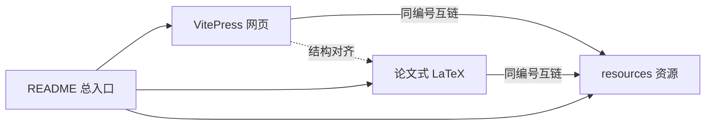

# AUFE课题组科研入门

<p align="center">
  
  
  
  
</p>

<p align="center">
  <b>深度学习 · 计算机视觉 · 医学影像 AI</b><br/>
  从文献到投稿的全流程入门体系 · 网页 / 手册 / 资源三端同构
</p>

<p align="center">
  <a href="https://enco1128.github.io/AUFE-Research-group-study-materials/"><b>在线学习站点（正式）</b></a> ·
  <a href="https://enco1128.github.io/Research-group-study-materials/"><b>旧地址自动跳转</b></a> ·
  <a href="https://github.com/enco1128/AUFE-Research-group-study-materials"><b>GitHub 仓库</b></a> ·
  <a href="https://github.com/enco1128/AUFE-Research-group-study-materials/blob/main/latex/main.tex"><b>Overleaf 手册源码</b></a>
</p>

> **正式站点：** https://enco1128.github.io/AUFE-Research-group-study-materials/  
> 旧路径 `.../Research-group-study-materials/` 仅作跳转兼容，请收藏正式地址。

---

## 为什么做这一套

科研入门最常见的失败模式不是「资料不够」，而是**资料很多、路径不清**：链接散落、模板与正文脱节、网页和 PDF 讲两套故事。

本仓库把组内经验整理成**同一套编号体系**，让新人可以按路线推进，而不是在文件夹里迷路：

| 介质 | 角色 | 入口 |
|------|------|------|
| **学习网页** | 日常阅读与导航（VitePress） | [GitHub Pages 站点](https://enco1128.github.io/AUFE-Research-group-study-materials/) |
| **论文式手册** | 可打印 / Overleaf 协作全文 | [`latex/main.tex`](https://github.com/enco1128/AUFE-Research-group-study-materials/blob/main/latex/main.tex) |
| **分阶段资源** | 模板、范例、清单、附图 | [`resources/`](https://github.com/enco1128/AUFE-Research-group-study-materials/tree/main/resources) |
| **个人模板** | 学习计划等可复制文件 | [`templates/`](https://github.com/enco1128/AUFE-Research-group-study-materials/tree/main/templates) |

信息架构参考 [智科全家桶](https://njuis-students.github.io/) 的模块化组织方式，内容聚焦**课题组科研全流程**（非学院通识 wiki）。




---

## 30 秒上手

### 方式 A · 直接打开网页（推荐）

1. 打开站点首页：  
   **https://enco1128.github.io/AUFE-Research-group-study-materials/**
2. 从首页四张卡片进入：导论 → 技能链路 → 课题范式 → 八周路线
3. 需要模板时，页面内「仓库资源」链接会跳到对应 `resources/` 目录

### 方式 B · 本地预览网页

```bash
git clone https://github.com/enco1128/AUFE-Research-group-study-materials.git
cd AUFE-Research-group-study-materials
npm install
npm run docs:dev
```

浏览器打开终端提示的本地地址即可。

### 方式 C · Overleaf 编辑论文式手册

1. 打开 [Overleaf](https://www.overleaf.com/) → **New Project** → **Import from GitHub**
2. 选择仓库 [`enco1128/AUFE-Research-group-study-materials`](https://github.com/enco1128/AUFE-Research-group-study-materials)
3. 主文件设为 [`latex/main.tex`](https://github.com/enco1128/AUFE-Research-group-study-materials/blob/main/latex/main.tex)
4. 编译器选择 **XeLaTeX** → 编译得到 PDF

手册体例：Abstract → Introduction → Related Work → Method → Experiments → Writing → Case Study → Conclusion → Appendix。

---

## 课程地图（可点击）

每一章同时对应：**在线页面** · **仓库正文** · **资源目录**。

| 阶段 | 论文式章节 | 在线阅读 | 仓库 Markdown | 配套资源 |
|------|------------|----------|---------------|----------|
| 01 | Introduction | [为何做科研](https://enco1128.github.io/AUFE-Research-group-study-materials/1-导论/1-为何做科研.html) · [心态与规范](https://enco1128.github.io/AUFE-Research-group-study-materials/1-导论/2-心态误区与规范.html) | [docs/1-导论](https://github.com/enco1128/AUFE-Research-group-study-materials/tree/main/docs/1-导论) | [resources/01-mindset](https://github.com/enco1128/AUFE-Research-group-study-materials/tree/main/resources/01-mindset) |
| 02 | Related Work | [文献检索与精读](https://enco1128.github.io/AUFE-Research-group-study-materials/2-文献/1-文献检索与精读.html) | [docs/2-文献](https://github.com/enco1128/AUFE-Research-group-study-materials/tree/main/docs/2-文献) | [resources/02-literature](https://github.com/enco1128/AUFE-Research-group-study-materials/tree/main/resources/02-literature) |
| 03 | Method | [代码与工程基础](https://enco1128.github.io/AUFE-Research-group-study-materials/3-代码/1-代码与工程基础.html) | [docs/3-代码](https://github.com/enco1128/AUFE-Research-group-study-materials/tree/main/docs/3-代码) | [resources/03-coding](https://github.com/enco1128/AUFE-Research-group-study-materials/tree/main/resources/03-coding) |
| 04 | Experiments | [Idea 与实验](https://enco1128.github.io/AUFE-Research-group-study-materials/4-实验/1-Idea与实验.html) | [docs/4-实验](https://github.com/enco1128/AUFE-Research-group-study-materials/tree/main/docs/4-实验) | [resources/04-experiment](https://github.com/enco1128/AUFE-Research-group-study-materials/tree/main/resources/04-experiment) |
| 05 | Writing | [写作工具与投稿](https://enco1128.github.io/AUFE-Research-group-study-materials/5-写作/1-写作工具与投稿.html) | [docs/5-写作](https://github.com/enco1128/AUFE-Research-group-study-materials/tree/main/docs/5-写作) | [resources/05-writing](https://github.com/enco1128/AUFE-Research-group-study-materials/tree/main/resources/05-writing) |
| 06 | Case Study | [问题拆解框架](https://enco1128.github.io/AUFE-Research-group-study-materials/6-课题范式/1-问题拆解框架.html) | [docs/6-课题范式](https://github.com/enco1128/AUFE-Research-group-study-materials/tree/main/docs/6-课题范式) | [resources/06-domain](https://github.com/enco1128/AUFE-Research-group-study-materials/tree/main/resources/06-domain) |
| 07 | Conclusion | [八周学习路径](https://enco1128.github.io/AUFE-Research-group-study-materials/7-路线图/1-八周学习路径.html) | [docs/7-路线图](https://github.com/enco1128/AUFE-Research-group-study-materials/tree/main/docs/7-路线图) | [templates](https://github.com/enco1128/AUFE-Research-group-study-materials/tree/main/templates) |
| A | Appendix | [资源索引与外链](https://enco1128.github.io/AUFE-Research-group-study-materials/8-附录/1-资源索引.html) | [docs/8-附录](https://github.com/enco1128/AUFE-Research-group-study-materials/tree/main/docs/8-附录) | [resources/08-links](https://github.com/enco1128/AUFE-Research-group-study-materials/tree/main/resources/08-links) |

---

## 八周执行路线

完整说明见：[八周学习路径（在线）](https://enco1128.github.io/AUFE-Research-group-study-materials/7-路线图/1-八周学习路径.html) · [学习计划模板](https://github.com/enco1128/AUFE-Research-group-study-materials/blob/main/templates/learning_plan.md)

| 周次 | 目标 | 必读 | 关键产出 |
|------|------|------|----------|
| Week 1 | 环境与框架 | [导论](https://enco1128.github.io/AUFE-Research-group-study-materials/1-导论/1-为何做科研.html) · [代码](https://enco1128.github.io/AUFE-Research-group-study-materials/3-代码/1-代码与工程基础.html) · [PyTorch 60-min](https://pytorch.org/tutorials/beginner/deep_learning_60min_blitz.html) | 环境可跑 + 笔记 |
| Week 2–3 | 文献方法 | [文献篇](https://enco1128.github.io/AUFE-Research-group-study-materials/2-文献/1-文献检索与精读.html) · [literature_list.csv](https://github.com/enco1128/AUFE-Research-group-study-materials/blob/main/resources/02-literature/literature_list.csv) | 文献 list ≥ 10 条 |
| Week 4–5 | 模型与代码 | [实验篇](https://enco1128.github.io/AUFE-Research-group-study-materials/4-实验/1-Idea与实验.html) · [精读清单](https://github.com/enco1128/AUFE-Research-group-study-materials/blob/main/resources/04-experiment/classic_models.md) · [mli/paper-reading](https://github.com/mli/paper-reading) | 精读笔记 + 开源仓库对照 |
| Week 6 | 课题对齐 | [课题范式](https://enco1128.github.io/AUFE-Research-group-study-materials/6-课题范式/1-问题拆解框架.html) · [dataset_sheet.csv](https://github.com/enco1128/AUFE-Research-group-study-materials/blob/main/resources/06-domain/dataset_sheet.csv) | 问题拆解 1 页 |
| Week 7 | 第一次汇报 | [写作篇](https://enco1128.github.io/AUFE-Research-group-study-materials/5-写作/1-写作工具与投稿.html) · [周报模板](https://github.com/enco1128/AUFE-Research-group-study-materials/blob/main/resources/05-writing/weekly_report.md) | 组会 PPT + 周报 |
| Week 8 | 巩固与规划 | [路线图](https://enco1128.github.io/AUFE-Research-group-study-materials/7-路线图/1-八周学习路径.html) · [附录外链](https://enco1128.github.io/AUFE-Research-group-study-materials/8-附录/1-资源索引.html) | 下阶段 roadmap |

**入门结束标准：** 能维护文献 list；精读综述与相关论文并做笔记；跑通框架并浏览领域开源仓库；完成至少一次正式汇报；能说清课题问题定义与数据来源。

---

## 仓库结构

```text
AUFE-Research-group-study-materials/
├── docs/                      # VitePress 学习网页（主阅读面）
│   ├── .vitepress/            # 站点配置与主题（华文中宋 + Times New Roman）
│   ├── 1-导论/ … 8-附录/      # 按阶段编号的正文
│   └── index.md               # 首页
├── latex/                     # Overleaf / XeLaTeX 论文式手册
│   ├── main.tex
│   └── sections/              # 与 docs 同序的章节
├── resources/                 # 模板、范例、PDF、附图（与章节编号对齐）
├── templates/                 # 个人学习计划等通用模板
├── .github/workflows/         # GitHub Pages 自动部署
├── package.json
└── README.md                  # 本文件
```

---

## 精选资源快链

| 类型 | 链接 |
|------|------|
| 文献 list 模板 | [literature_list.csv](https://github.com/enco1128/AUFE-Research-group-study-materials/blob/main/resources/02-literature/literature_list.csv) |
| 汇报要点 PDF | [literature_and_report_tips.pdf](https://github.com/enco1128/AUFE-Research-group-study-materials/blob/main/resources/02-literature/literature_and_report_tips.pdf) |
| 周报模板 / 范例 | [weekly_report.md](https://github.com/enco1128/AUFE-Research-group-study-materials/blob/main/resources/05-writing/weekly_report.md) · [example](https://github.com/enco1128/AUFE-Research-group-study-materials/blob/main/resources/05-writing/weekly_report_example.md) |
| 数据集整理表 | [dataset_sheet.csv](https://github.com/enco1128/AUFE-Research-group-study-materials/blob/main/resources/06-domain/dataset_sheet.csv) |
| 投稿期刊示意 | [journal_list.jpg](https://github.com/enco1128/AUFE-Research-group-study-materials/blob/main/resources/06-domain/journal_list.jpg) |
| 会议截止 | [ccfddl.top](https://ccfddl.top/) |
| 医学影像挑战数据 | [Grand Challenge](https://grand-challenge.org/) |

更多外链见：[附录 · 资源索引](https://enco1128.github.io/AUFE-Research-group-study-materials/8-附录/1-资源索引.html)

---

## 设计原则

1. **一条主线**：Introduction → Related Work → Method → Experiments → Writing → Case Study → Conclusion  
2. **三端同号**：网页路径、LaTeX `\section`、`resources/0x-*` 使用同一阶段编号  
3. **可执行**：每章含目标、Checklist、下一阶段入口，而不是只堆链接  
4. **可协作**：Markdown 便于 PR；LaTeX 便于 Overleaf 多人改稿与导出 PDF  
5. **可复用**：模板与范例分开放，范例脱敏，模板可直接复制填写  

---

## 贡献与规范

欢迎通过 [Issues](https://github.com/enco1128/AUFE-Research-group-study-materials/issues) / [Pull Requests](https://github.com/enco1128/AUFE-Research-group-study-materials/pulls) 修正失效链接、补充经验或完善某一阶段资源。

请勿提交：未脱敏的项目细节、隐私数据、未授权数据集、账号与密钥。

---

## 许可

本仓库内容以 [CC BY 4.0](https://github.com/enco1128/AUFE-Research-group-study-materials/blob/main/LICENSE) 授权：允许分享与改编，需署名。

---

<p align="center">
  <i>Start with the site · Stay with the roadmap · Ship with the handbook.</i><br/>
  <a href="https://enco1128.github.io/AUFE-Research-group-study-materials/">enco1128.github.io/AUFE-Research-group-study-materials</a>
</p>
